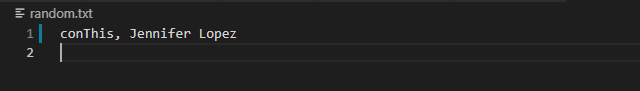

# Liri Node App 🎵 🎥 🎤

Liri Node App is a version of Siri (or preferred, Alexa), which returns song, concert and movie information based on language input.  I wired my Liri-Bot with Inquirer, to enhance user experience.


## Functionality 💪
#### Here's how I created the app: 

* I initialized a package.json file for my project by running npm init -y.  I created a .gitignore file so that my node_modules wouldn't bog down gitHub, and so that my .env, containing my spotify id & secret, won't be exposed to the world. The .env file is then linked through to he keys.js file, which is in turn executed in my liri.js app file.


* The functions that make calls to the different APIs are then listed - movThis, spotThis, and conThis, making calls to the OMDB, Spotify, and BandsInTown APIs, respectively.

```
function spotThis(userInput) {
    spotify.search(
        { 
            type: 'track', 
            query: userInput,
        }, 
        function(err, data) {
            if (err) {
                return console.log('Error occurred: ' + err);
            };

            
            var songInfo = data.tracks.items[0];
            console.log(spacing);
            console.log(`${songInfo.name} \n\n Artist: ${songInfo.artists[0].name} \n\n Album : ${songInfo.album.name} \n\n Preview: ${songInfo.preview_url}`);
            console.log(spacing);

            liri();

        });
};

```

* The liri function is the game function, which gets the user started with the first inquirer question - asking that a command be selected from the list of options.  I had a lot of issues with this question repeating itself when selecting using the down arrow - almost like I had something recursive in my code - but I found that by shortening the message of the question (which is probably good to do anyway, right?), I was able to eliminate that problem.  The user can pick from the following commands: Spotify This, Concert This, Movie This, or A Walk on the Wild Side.


* When the user makes the initial selection, a switch case handles the user input and results in running different functions.  For the concert, movie or song, the user is then prompted with another question - which artist, movie or song would you like to know more about?  

```
switch(command) {
    case "Spotify This":
        return spotifyThis();
    case "Concert This":
        return concertThis();
    case "Movie This":
        return movieThis();
    case "A Walk on the Wild Side":
        return  doWhatItSays();
    default:
        return console.log("make a better choice")
};
    

function spotifyThis() {
    inquirer.prompt([
        {
            name: "whatSong",
            message: "What song would you like to know more about?"
        }
    ]).then(function(answer) {
        userInput = `"${answer.whatSong}"`;    

        spotThis(userInput);
        
        
    });
};

```

* The user then can type-in their query, and the app will return :
    - Song Information - the most relevant (according to Spotify) artist, album and Spotify song preview URL, for the song that the user searches.
    

    - Upcoming Concerts - the upcoming concert venues, location, date and time, for the artist that the user searches.  Note, there are no returns for artists that aren't touring or aren't in the BandsInTown API. 
    
 
    - Movie Information - the title, year, IMDB & Rotten Tomato ratings, country, language, plot and actors, for the movie that a user searches.  This uses OMDB.
    


* The Walk on the Wild Side option reads my random.txt file.  My tutor helped me to use eval(), instead of another switch case, to run my (already-created) functions.  This method works by turning the first part of the random.txt (movThis, conThis or spotThis) into functions - thereby accessing my functions and returning the redefined userInput variable, which uses the second part (after the comma) of my random.txt.  

```
function doWhatItSays() {
    fs.readFile(randText, "utf8", function(error, data) {
        if (error) return console.log(error);

        var dataArray = data.split(", ");
        var liriCommand = eval(dataArray[0]);
        console.log(liriCommand);

        userInput = dataArray[1];
        liriCommand(userInput);
                    

    });
};

```

* In this case, my random.txt file specifies a movie query, using the movThis command.  If you'd like to try different commands within random.txt, you can use conThis for Concert This, or spotThis for Spotify This.

* A REALLY IMPORTANT NOTE - if you are trying conThis within the random.txt, you need to remove the quotes from your query, as demonstrated in the following picture:
    - 
    - This is because the BandsInTown API doesn't like the quotes for the purposes of its query.  

* Liri will continue to run after creating returns, since it is called within each function.  I experimented with Q to Quit within Inquirer, but couldn't get it to work, so I specify the usual way to exit - ctrl-C.  


## Getting Started 🏁

These instructions will get you a copy of the project up and running on your local machine for grading and testing purposes. 

1. You will need a Spotify API key and secret, saved in a .env file in order for this app to function.
2. clone repository. 
3. open repository in your IDE of choice.
4. Install node packages specified in the package.json - axios, dotenv, inquirer, moment, node-spotify-api.
5. Open the liri-node-app in Bash.
4. Run node liri.js.


## Built With 🔧

* NodeJS
* Spotify API
* BandsInTown API
* OMDB API
* MomentJS
* Inquirer


## Authors ⌨️

* **Genevieve DePriest** - [gdepriest](https://github.com/gdepriest)

## Acknowledgments 🌟

* Amber Burroughs, Tutoring badass
* Lindsey, TA goddess
* Grace, TA goddess
* Sarah Cullen, Maestro
